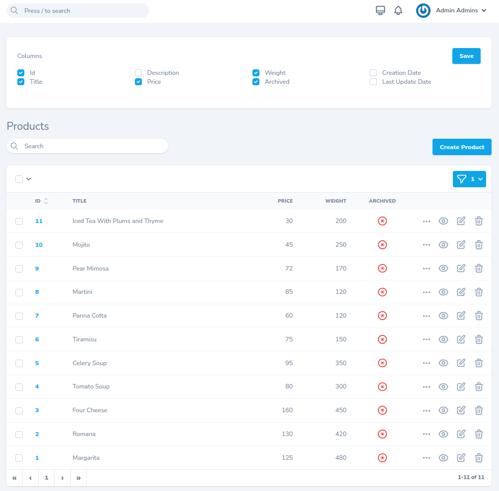
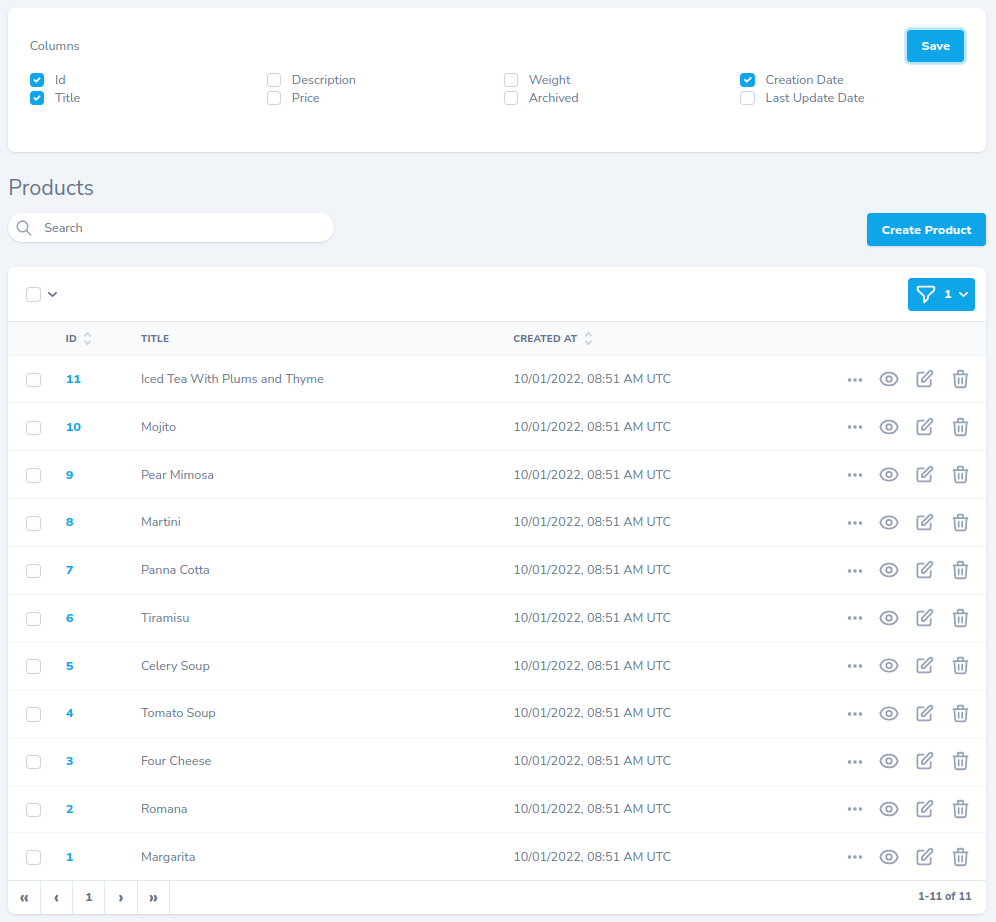

# ColumnsCard

A Laravel Nova card for showing/hiding columns of resource on index.

In order to use `ColumnsCard` on resource use `HasColumnsFilter` trait on it and implement `columnsFilterFields` method, which returns an array of attributes that should be available. Returned array key is the attribute name and value must be `boolean` or an `array`, where there are two options available, namely: `checked` (whether attribute is visible by default) and `label`.

For example having `'id' => true`, will create a checkbox with `Id` as `label` and `true` as the value of `checked`. 

``` php 
use Andriichello\ColumnsCard\HasColumnsFilter;

class Product extends Resource
{
    use HasColumnsFilter;

    /**
     * Get the fields displayed by the resource.
     *
     * @param Request $request
     * @return array
     */
    public function fields(Request $request): array
    {
        return [
            ID::make()->sortable(),
            Text::make('Title'),
            Text::make('Description'),
            Number::make('Price'),
            Number::make('Weight'),
            Boolean::make('Archived'),
            MorphToMany::make('Categories'),
            DateTime::make('Created At'),
            DateTime::make('Updated At'),
        ];
    }

    /**
     * Get columns filter fields.
     *
     * @param Request $request
     *
     * @return array
     * @SuppressWarnings(PHPMD.UnusedFormalParameter)
     */
    protected function columnsFilterFields(Request $request): array
    {
        return [
            'id' => true,
            'title' => true,
            'description' => false,
            'price' => true,
            'weight' => true,
            'archived' => true,
            'created_at' => ['checked' => false, 'label' => 'Creation Date'],
            'updated_at' => ['checked' => false, 'label' => 'Last Update Date'],
        ];
    }
}
```

## This is how it looks like




